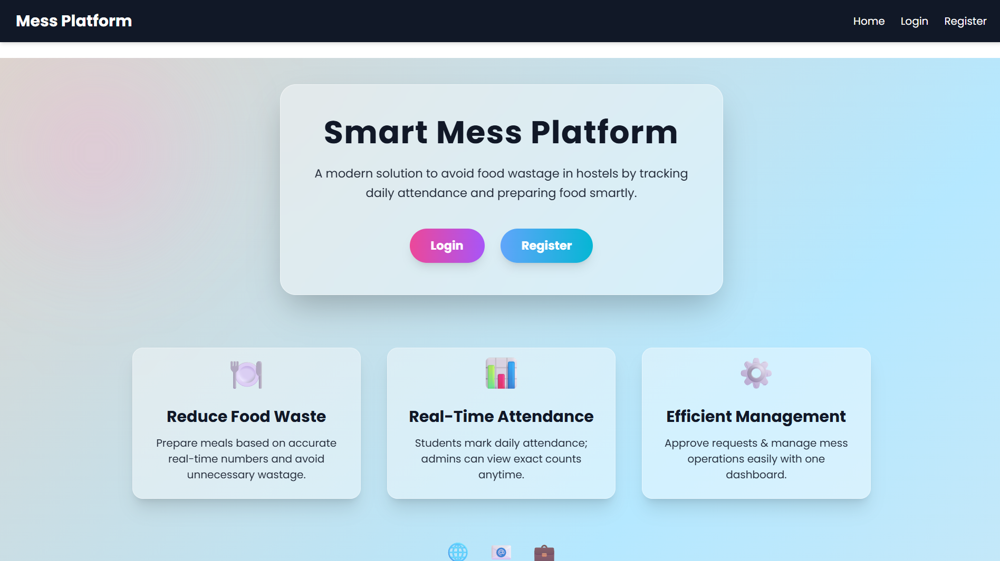
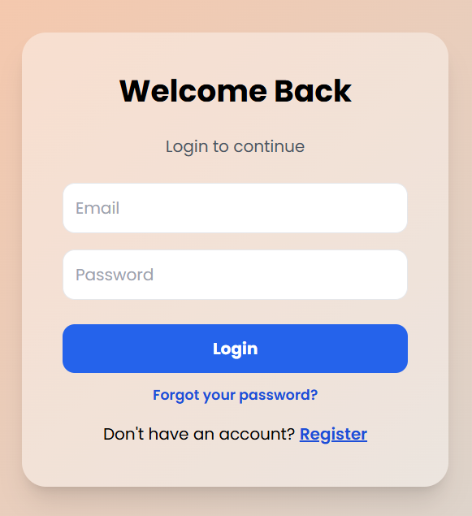
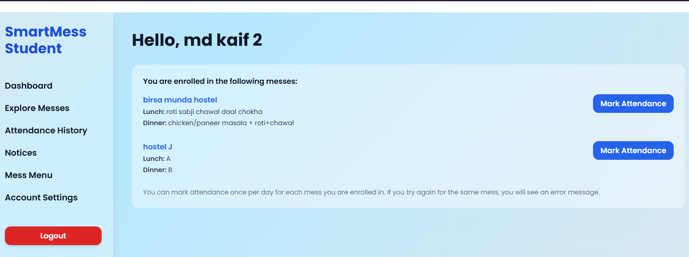
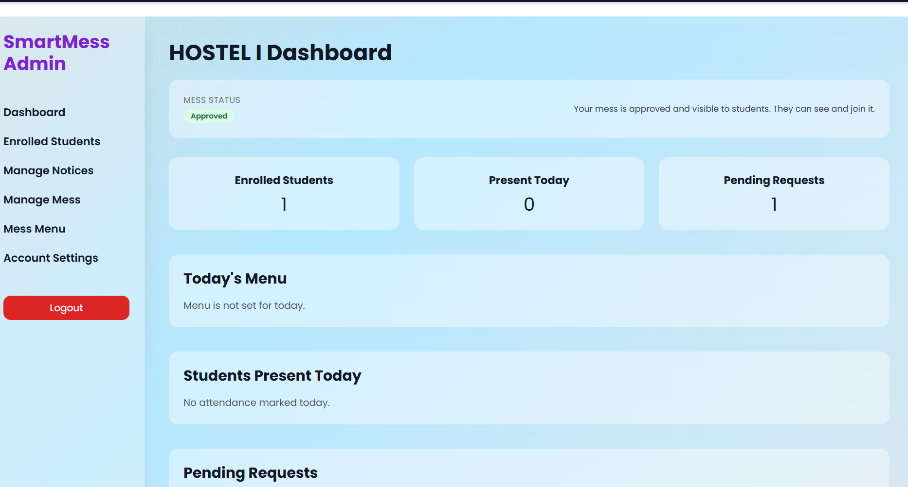

# Smart Mess Platform 3

Smart Mess Platform is a full-stack web application designed to simplify mess management for hostels and colleges. It helps reduce manual coordination by providing a centralized system for students and mess admins.

**Tech Stack:** React, Node.js, Express, MySQL  
**Role:** Full-stack development (backend APIs, database design, frontend integration)

---

## Quick Start (Run in 2 Terminals)

**Terminal 1 (Backend):**
```bash
cd mess-platform3/backend
npm install
# create .env (see "How to Run Locally")
npm run dev
```

**Terminal 2 (Frontend):**
```bash
cd mess-platform3/frontend
npm install
npm start
```

---

## Table of Contents
- [Problem Statement](#problem-statement)
- [Features](#features)
- [Screenshots](#screenshots)
- [System Architecture](#system-architecture)
- [Database Design (High Level)](#database-design-high-level)
- [How to Run Locally](#how-to-run-locally)
- [Deployment](#deployment)
- [Future Enhancements](#future-enhancements)
- [What I Learned](#what-i-learned)
- [Notes](#notes)

---

## Problem Statement
Traditional hostel mess management relies on manual registers, verbal coordination, and static notice boards. This leads to inaccurate attendance tracking, food wastage, lack of transparency, and poor communication between students and mess administrators.

Smart Mess Platform digitizes this workflow by providing real-time meal tracking, menu management, and role-based dashboards.

---

## Features
- Student registration and authentication
- Daily/weekly mess menu management
- Attendance / meal tracking
- Admin dashboard for mess management
- Secure APIs using JWT authentication
- Role-based access control (Student / Admin)
- JWT-based secure authentication
- Attendance tracking with date-wise records
- Admin-controlled menu updates

---

## Screenshots

### Home Page


### Login Page


### Student Dashboard


### Admin Dashboard


---

## System Architecture
- React frontend communicates with backend via REST APIs
- Node.js + Express handles authentication, business logic, and authorization
- MySQL stores user data, menus, attendance, and roles
- JWT is used for stateless authentication between client and server


---

## Database Design (High Level)
- users (id, name, email, role, password_hash)
- menus (id, date, meal_type, items)
- attendance (user_id, date, meal_status)
- admins (user_id, permissions)

---

## How to Run Locally
This section explains how **anyone** can download this repo and run it on their local machine.

### Prerequisites
- **Node.js** (LTS version recommended)
- **npm** (comes with Node.js)
- A running **MySQL** instance (or the DB your backend is configured for)

### Project Structure
- `mess-platform3/backend` – Node.js/Express API + database
- `mess-platform3/frontend` – React UI (Create React App)

> Important: `node_modules/` and `.env` files are **not committed**. After downloading the repo, you must run `npm install` and create your own `.env`.

### Backend Setup (`mess-platform3/backend`)
1. Go to the backend folder:
   ```bash
   cd mess-platform3/backend
   ```
2. Install dependencies:
   ```bash
   npm install
   ```
3. Create a `.env` file (required):
   - Create: `mess-platform3/backend/.env`
   - Example (change values to your own):
     ```env
     DB_HOST=localhost
     DB_PORT=3306
     DB_USER=your_mysql_username
     DB_PASSWORD=your_mysql_password
     DB_NAME=your_database_name

     JWT_SECRET=your_jwt_secret_key
     PORT=5000
     ```
   Adjust variable names/values to match your own MySQL setup and what `src/config/db.js` expects.
4. Create the database and tables (if needed):
   - Create the database named in `DB_NAME`.
   - Run any SQL scripts you have (or let the app create tables if it does that automatically).
5. Start the backend:
   ```bash
   npm run dev
   ```

### Frontend Setup (`mess-platform3/frontend`)
1. Go to the frontend folder:
   ```bash
   cd mess-platform3/frontend
   ```
2. Install dependencies:
   ```bash
   npm install
   ```
3. (Optional) Configure API base URL:
   - Create: `mess-platform3/frontend/.env`
   - Example:
     ```env
     REACT_APP_API_BASE_URL=http://localhost:5000
     ```
4. Start the frontend:
   ```bash
   npm start
   ```
5. Open in browser:
   - Default: `http://localhost:3000`

Make sure the **backend is running** and that the frontend is pointing to the correct API base URL.

---

## Deployment
- Currently runs locally in development mode
- Planned deployment using Docker and cloud hosting

---

## Future Enhancements
- QR-based meal attendance
- Mobile app version (React Native)
- Analytics dashboard for food wastage
- Cloud deployment (AWS / GCP)
- Notification system for menu updates

---

## What I Learned
- Designing RESTful APIs with authentication and authorization
- Implementing JWT-based secure login flows
- Structuring full-stack applications for scalability
- Handling relational data and database normalization
- Frontend-backend integration and API error handling

---

## Notes
- The folder `readme_stuffs/` is **not needed to run the project** (it currently contains screenshots for this README).
- `.env` files and `node_modules/` are **not committed**; each developer must create their own `.env` and run `npm install`.
- For other diagrams, refer to the `.jpeg` / `.png` architecture files in the repo.
