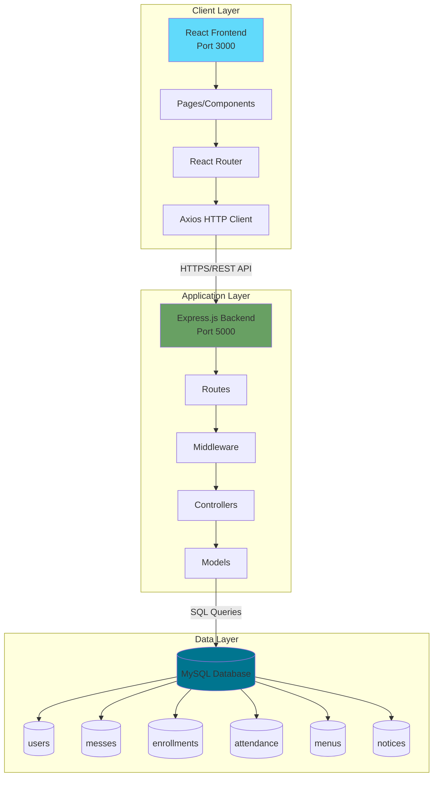
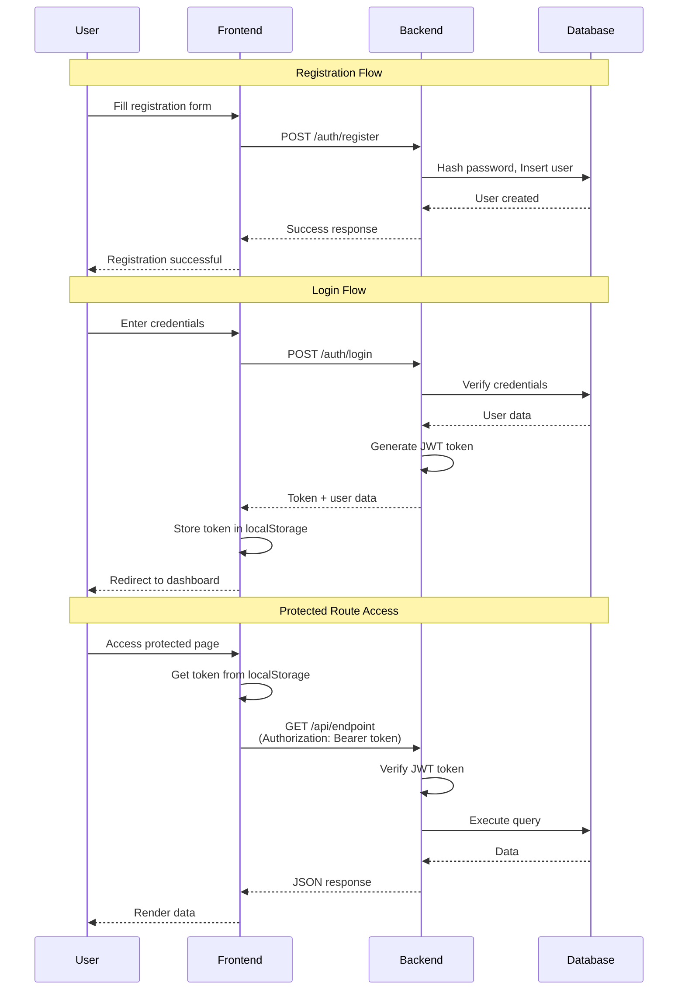
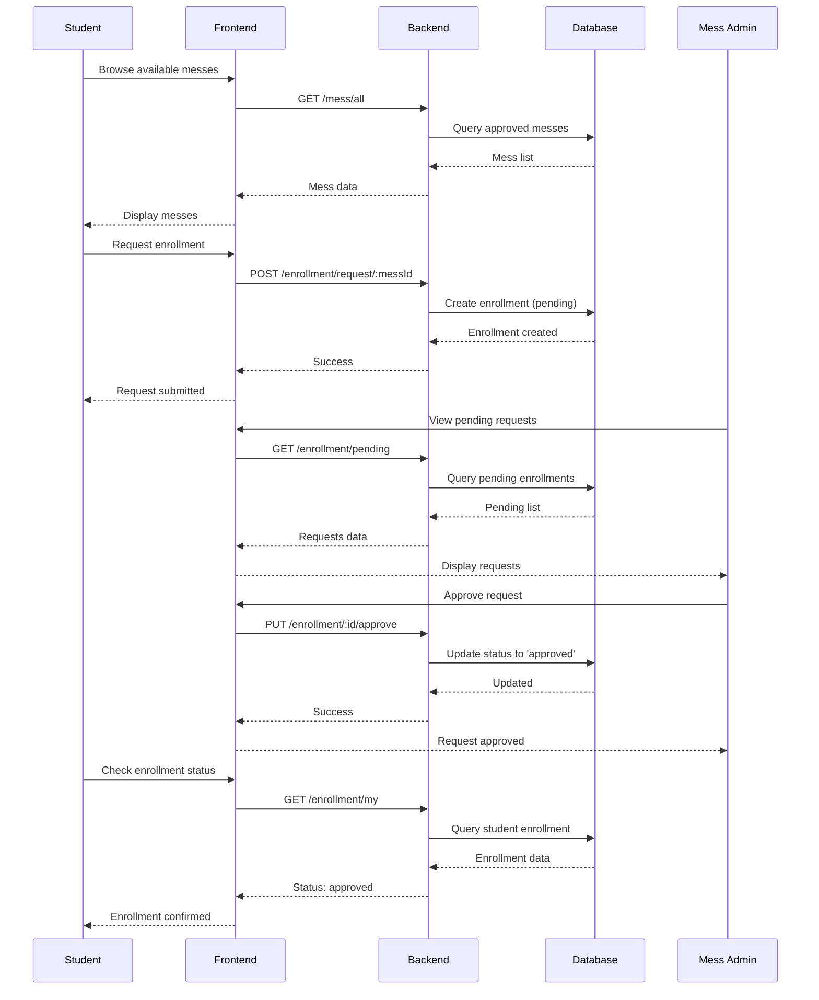
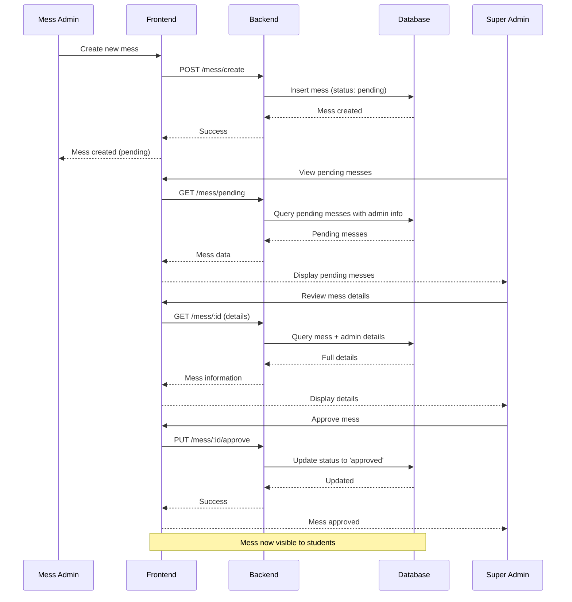
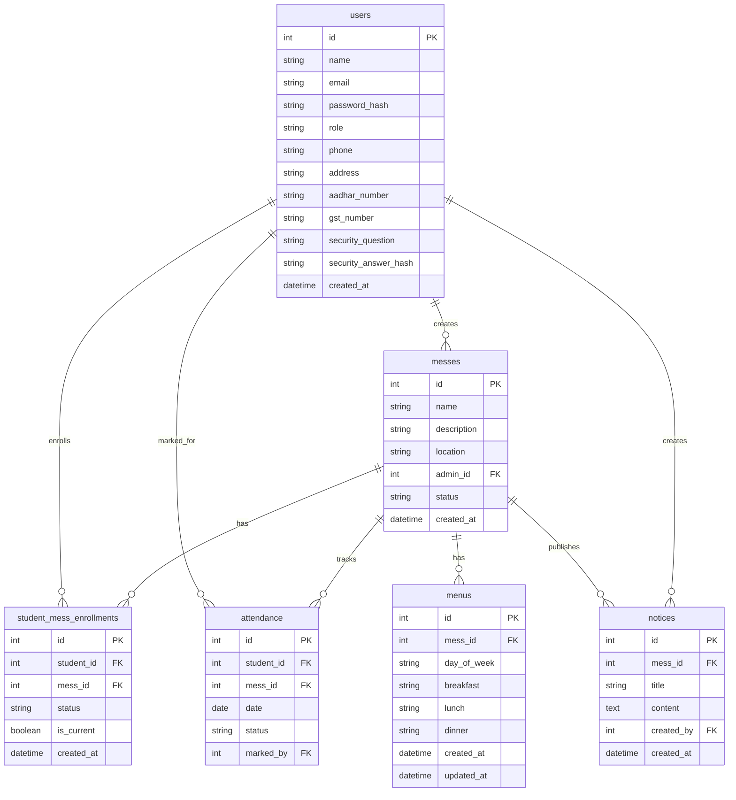
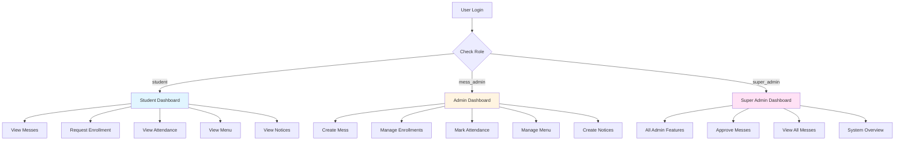
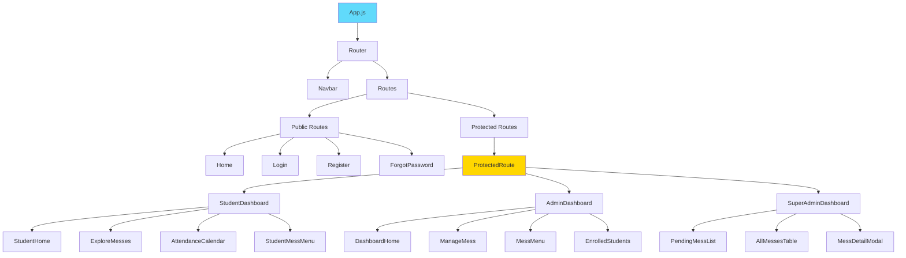
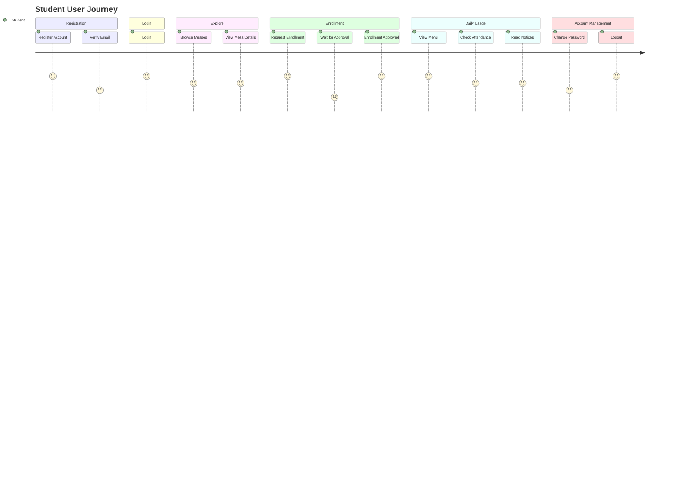

# Mess Platform - Visual Architecture Diagrams

This document contains visual diagrams that complement the main SYSTEM_ARCHITECTURE.md file.

## 1. High-Level System Architecture



## 2. Authentication Flow



## 3. Student Enrollment Flow



## 4. Mess Creation & Approval Flow



## 5. Data Model Relationships



## 6. Request-Response Cycle

```mermaid
graph LR
    A[User Action] --> B[React Component]
    B --> C[Event Handler]
    C --> D[Axios Request]
    D --> E[Express Server]
    E --> F[CORS Middleware]
    F --> G[JSON Parser]
    G --> H{JWT Required?}
    H -->|Yes| I[JWT Verification]
    H -->|No| J[Route Handler]
    I -->|Valid| J
    I -->|Invalid| K[401 Unauthorized]
    J --> L[Controller]
    L --> M[Model/DB Query]
    M --> N[(MySQL)]
    N --> O[Results]
    O --> P[Controller Logic]
    P --> Q[JSON Response]
    Q --> R[Axios Response]
    R --> S[State Update]
    S --> T[UI Re-render]
    
    style A fill:#ff9999
    style T fill:#99ff99
    style K fill:#ff6666
```



## 7. Role-Based Access Control



## 8. Component Hierarchy (Frontend)



## 9. Backend Request Processing

```mermaid
graph TD
    A[HTTP Request] --> B[Express App]
    B --> C[CORS Check]
    C --> D[Body Parser]
    D --> E{Route Match}
    
    E --> F[/auth/*]
    E --> G[/mess/*]
    E --> H[/enrollment/*]
    E --> I[/attendance/*]
    E --> J[/menu/*]
    E --> K[/notice/*]
    
    F --> L[Auth Routes]
    G --> M[Mess Routes]
    H --> N[Enrollment Routes]
    I --> O[Attendance Routes]
    J --> P[Menu Routes]
    K --> Q[Notice Routes]
    
    L --> R{Protected?}
    M --> R
    N --> R
    O --> R
    P --> R
    Q --> R
    
    R -->|Yes| S[JWT Middleware]
    R -->|No| T[Controller]
    S -->|Valid| T
    S -->|Invalid| U[401 Error]
    
    T --> V[Business Logic]
    V --> W[Model Layer]
    W --> X[Database Query]
    X --> Y[Response]
    Y --> Z[JSON Response]

    style R fill:#ffd700
    style S fill:#ff9999
    style Y fill:#99ff99
```

## 10. Complete User Journey: Student



---

## How to Use These Diagrams

These Mermaid diagrams can be rendered in:
- GitHub (automatically)
- GitLab (automatically)
- Markdown viewers with Mermaid support
- VS Code with Mermaid extensions
- Online Mermaid editors (https://mermaid.live)

To view the diagrams, simply open this file in any of the above platforms, and the diagrams will render automatically.


